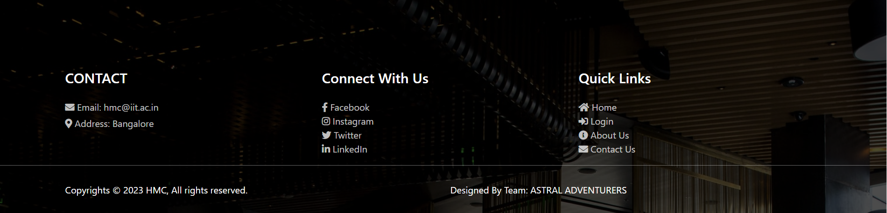
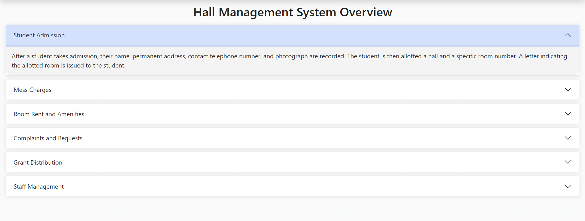

# HMC Home

<nav class="navbar navbar-expand-lg py-1 sticky-top bg-white shadow">
    

        <a class="navbar-brand" href="#home">
            <h2 class="logo animate-characters">Hall Management Center</h2>
        </a>
        <button class="navbar-toggler" type="button" data-bs-toggle="collapse" data-bs-target="#navbarNav">
            
        </button>

</nav>

    

            

            

            

        

        

            

                
                

                    <h1 class="text-white">WELCOME TO HALL MANAGEMENT CENTER</h1>
                

            

            

                
                

                    <h1 class="text-white">WELCOME TO HALL MANAGEMENT CENTER</h1>
                

            

            

                
                

                    <h1 class="text-white">WELCOME TO HALL MANAGEMENT CENTER</h1>
                

            

        

        <button class="carousel-control-prev" type="button" data-bs-target="#home" data-bs-slide="prev">
            
        </button>
        <button class="carousel-control-next" type="button" data-bs-target="#home" data-bs-slide="next">
            
        </button>

    

                

                    
                

                

                    <h1>About us</h1>
                    <section id="introduction" >
                            
<b>At the heart of our student community lies the robust and efficient Hall Management System, a comprehensive software solution designed to streamline and automate various book-keeping activities associated with our day-to-day operations. Tailored to meet the unique needs of our dynamic hostel environment, this software ensures a seamless and secure management experience for both students and administrators.</b>

                        </section>

                <section id="key-features">
                            <h2 >Key Features:</h2>
                            <ul>
                                <li>Admission Module: Effortlessly manage student admissions, room allotments, and generate personalized room allotment letters.</li>
                                <li>Mess and Rent Management: Simplify the mess charges and room rent calculations, ensuring accurate financial tracking for both students and managers.</li>
                                <li>Amenities and Complaints: Facilitate student complaints through a user-friendly web interface, categorized by type, with quick response features for wardens.</li>
                                <li>Financial Management: Streamline the distribution of annual grants, expenditure tracking, and comprehensive financial reporting.</li>
                                <li>Occupancy Tracking: Real-time monitoring of room occupancy at both hall and overall levels for efficient space management.</li>
                                <li>Salary and Leave Management: Ensure hassle-free salary processing for temporary staff, along with easy leave management.</li>
                                <li>Expense Tracking: Monitor petty expenses seamlessly, maintaining financial transparency for all HMC operations.</li>
                            </ul>
                        </section>

                        <section id="join-us">
                            <h2>Join Us in Streamlining Campus Living:</h2>
                            
Experience a new era of hostel management with the IIT Students' Hall Management Center Software. Embrace efficiency, transparency, and security in every aspect of your stay at our esteemed institute.

                            
Your seamless living experience starts here.

                        </section>
                    

            

    <h1 class="card-section-heading text-center">Our Services</h1>
    

        <!-- Developer Card 1 -->
        

            

            
               

<h2 class="accordion-section-heading text-center">Hall Management System Overview</h2>

    

        <h2 class="accordion-header" id="flush-headingOne">
            <button class="accordion-button collapsed" type="button" data-bs-toggle="collapse" data-bs-target="#flush-collapseOne" aria-expanded="false" aria-controls="flush-collapseOne">
                Student Admission
            </button>
        </h2>
        

            

                After a student takes admission, their name, permanent address, contact telephone number, and photograph are recorded. The student is then allotted a hall and a specific room number. A letter indicating the allotted room is issued to the student.
            

        

    

    

        <h2 class="accordion-header" id="flush-headingTwo">
            <button class="accordion-button collapsed" type="button" data-bs-toggle="collapse" data-bs-target="#flush-collapseTwo" aria-expanded="false" aria-controls="flush-collapseTwo">
                Mess Charges
            </button>
        </h2>
        

            

                Students incur monthly mess charges. The mess manager inputs the total charges for each student in a month on the mess account.
            

        

    

    

        <h2 class="accordion-header" id="flush-headingThree">
            <button class="accordion-button collapsed" type="button" data-bs-toggle="collapse" data-bs-target="#flush-collapseThree" aria-expanded="false" aria-controls="flush-collapseThree">
                Room Rent and Amenities
            </button>
        </h2>
        

            

                Each room has a fixed room rent. The halls provide certain amenities to the students, such as reading rooms, playrooms, TV rooms, etc. A fixed amount is levied on each student for amenities.
            

        

    

    

        <h2 class="accordion-header" id="flush-headingFour">
            <button class="accordion-button collapsed" type="button" data-bs-toggle="collapse" data-bs-target="#flush-collapseFour" aria-expanded="false" aria-controls="flush-collapseFour">
                Complaints and Requests
            </button>
        </h2>
        

            

                Students can raise various types of complaints and repair requests using a web browser. These include requests for fused lights, non-functional water taps, non-functional water filters, room repair, etc.
            

        

    

    

        <h2 class="accordion-header" id="flush-headingFive">
            <button class="accordion-button collapsed" type="button" data-bs-toggle="collapse" data-bs-target="#flush-collapseFive" aria-expanded="false" aria-controls="flush-collapseFive">
                Grant Distribution
            </button>
        </h2>
        

            

                The HMC chairman can distribute the annual grant among the different halls. Wardens of different halls can enter their expenditure details against the allocations.
            

        

    

    

        <h2 class="accordion-header" id="flush-headingSix">
            <button class="accordion-button collapsed" type="button" data-bs-toggle="collapse" data-bs-target="#flush-collapseSix" aria-expanded="false" aria-controls="flush-collapseSix">
                Staff Management
            </button>
        </h2>
        

            

                The halls employ attendants and gardeners. The Hall clerk can enter leave details for attendants or gardeners. At the end of every month, a consolidated list of salary payable to each employee is printed out.
            

        

    

<footer id="contact">
    

        

            

                

                    

                        <h4 class="text-white mb-4">CONTACT</h4>
                        
<i class="fas fa-envelope"></i> Email: hmc@iit.ac.in

                        
<i class="fas fa-map-marker-alt"></i> Address: Bangalore

                    

                

                

                    

                        <h4 class="text-white mb-4">Connect With Us</h4>
                        <ul class="social-media-list" style="list-style-type: none;padding: 0;">
                            <li><a href="https://www.facebook.com/"><i class="fab fa-facebook-f"></i> Facebook</a></li>
                            <li><a href="https://www.instagram.com/"><i class="fab fa-instagram"></i> Instagram</a></li>
                            <li><a href="https://twitter.com/"><i class="fab fa-twitter"></i> Twitter</a></li>
                            <li><a href="https://www.linkedin.com/"><i class="fab fa-linkedin-in"></i> LinkedIn</a></li>
                        </ul>
                    

                

                

                    

                        <h4 class="text-white mb-4">Quick Links</h4>
                        <ul class="footer-links" style="list-style-type: none;padding: 0;">
                            <li><a href="#"><i class="fas fa-home"></i> Home</a></li>
                            <li><a href="login.jsp"><i class="fas fa-sign-in-alt"></i> Login</a></li>
                            <li><a href="#about"><i class="fas fa-info-circle"></i> About Us</a></li>
                            <li><a href="#contact"><i class="fas fa-envelope"></i> Contact Us</a></li>
                        </ul>
                    

                

            

        

    

    

        

            

                

                    
Copyrights © 2023 HMC, All rights reserved.

                

                

                    
Designed By Team: ASTRAL ADVENTURERS

                

            

        

    

</footer>

