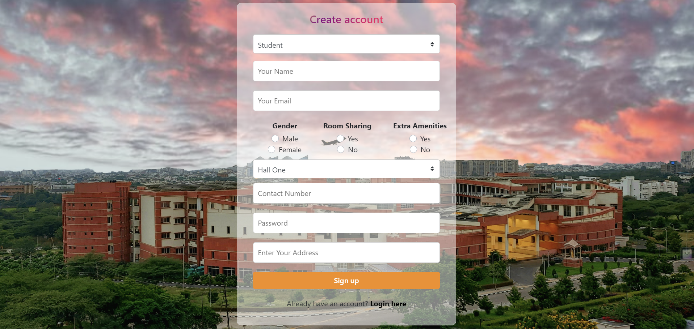

# HMC
## Hall Management Center Software

The IIT Students' Hall Management Center Software is a dynamic and secure solution designed to cater to the unique needs of the IIT community. It ensures a seamless and efficient management experience for both students and administrators.

### Key Features

* **Admission Module**: Effortlessly manage student admissions, room allotments, and generate personalized room allotment letters.
* **Mess and Rent Management**: Simplify the mess charges and room rent calculations, ensuring accurate financial tracking for both students and managers.
* **Amenities and Complaints**: Facilitate student complaints through a user-friendly web interface, categorized by type, with quick response features for wardens.
* **Financial Management**: Streamline the distribution of annual grants, expenditure tracking, and comprehensive financial reporting.
* **Occupancy Tracking**: Real-time monitoring of room occupancy at both hall and overall levels for efficient space management.
* **Salary and Leave Management**: Ensure hassle-free salary processing for temporary staff, along with easy leave management.
* **Expense Tracking**: Monitor petty expenses seamlessly, maintaining financial transparency for all HMC operations.

### Our Services

1. **Student Services**
   * Using our website, students can complaint about any issue like mess, room, staff, etc.
   * Students can check their old complaints and also the status.
   * Students can pay dues like mess due or college due.
   * Students can check dues.
2. **Warden Services**
   * Wardens can check complaints and solve complaints.
   * Wardens have full accessibility to check room details.
   * Wardens can solve student problems.
   * Wardens will give access to students.
3. **Clerk Services**
   * Clerks can give leaves to the Gardener and Attendars.
   * Clerks can add new Gardeners and Attendars.
   * Clerks can consolidate the monthly fee of the regular Staff.
4. **Mess Manager Services**
   * Mess Managers can check the number of student has paid mess fee.
   * Mess Managers can print the fee paid student.
5. **Attender and Gardener Services**
   * Attenders and Gardeners can apply for leaves.
   * Attenders and Gardeners can request tools.

### Hall Management System Overview

1. **Student Admission**: After a student takes admission, their name, permanent address, contact telephone number, and photograph are recorded. The student is then allotted a hall and a specific room number. A letter indicating the allotted room is issued to the student.
2. **Mess Charges**: Students incur monthly mess charges. The mess manager inputs the total charges for each student in a month on the mess account.
3. **Room Rent and Amenities**: Each room has a fixed room rent. The halls provide certain amenities to the students, such as reading rooms, playrooms, TV rooms, etc. A fixed amount is levied on each student for amenities.
4. **Complaints and Requests**: Students can raise various types of complaints and repair requests using a web browser. These include requests for fused lights, non-functional water taps, non-functional water filters, room repair, etc.
5. **Grant Distribution**: The HMC chairman can distribute the annual grant among the different halls. Wardens of different halls can enter their expenditure details against the allocations.
6. **Staff Management**: The halls employ attendants and gardeners. The Hall clerk can enter leave details for attendants or gardeners. At the end of every month, a consolidated list of salary payable to each employee is printed out.

### Contact Us

Email: [hmc@iit.ac.in](mailto:hmc@iit.ac.in)

Address: Bangalore

## Software Interface
### Home 

### Sign Up

### Login

